# `data/slukta.sqlite` schema reference

## Goal

Reverse-engineered reference for the SQLite database at `data/slukta.sqlite`,
which holds the domain data a future `apps/backend` will serve. The doc covers:

1. **Onboarding** — a diagram and per-table prose so a human picks up the
   shape quickly.
2. **Rewrite input** — faithful documentation of what exists today plus a
   section of open questions and probable bugs, so the backend design
   conversation has a common substrate.
3. **AI-agent context** — exhaustive column listings, inferred JSON shapes
   for opaque `TEXT` columns, and explicit naming conventions, so agents
   can write correct queries without additional exploration.

The doc is **faithful to the current schema**. Everything under "Open design
questions" and "Probable bugs" is commentary, not a proposal — the point is
to surface the decisions the rewrite will need to make, not to pre-empt them.

## Conventions

A few things apply to every table below; stated once here so the per-table
sections don't repeat them.

- **Identifiers are mixed.** Some columns are `snake_case` (`person.first_name`,
  `external_id.person_id`), others are quoted `"camelCase"` (`person_mention."personId"`,
  `bygdebok."publicationYear"`). Both conventions coexist in the same database.
  In SQL, the quoted columns **must be quoted** — `SELECT personId FROM person_mention`
  is an error; `SELECT "personId" FROM person_mention` is correct.
- **Primary keys are UUID-like text.** Most tables have `id TEXT` with a default
  generator: `lower(hex(randomblob(4))) || '-' || ... ` — a SQLite expression that
  produces a v4-shaped UUID. The only exception is `external_id.id`, which is
  `INTEGER PRIMARY KEY AUTOINCREMENT`.
- **Date columns are `TEXT` with inconsistent format.** See the "Data snapshot"
  section for what actually appears. Expect a mix of `YYYY-MM-DD`, `YYYY-MM`,
  bare `YYYY`, empty strings, and (in `relationship`) the literal string
  `"undefined"`.
- **No `CHECK` constraints on enum-like columns.** Several columns function as
  enums (`person.sex`, `record.recordType`, `document_mention.role`, etc.) but
  are declared as plain `TEXT`. The observed vocabularies are documented per
  column; treat them as de-facto rather than enforced.
- **Three tables are empty.** `event`, `external_id`, and `document` all have
  0 rows as of the snapshot date. They are included in the reference below
  because the schema is what matters for design, but flagged throughout.

## Overview diagram

```mermaid
erDiagram
    person {
        text id PK
    }
    parent_child {
        text parent_id PK
        text child_id PK
    }
    relationship {
        text id
        text person1Id FK
        text person2Id FK
    }
    person_mention {
        text id PK
        text personId FK
        text recordId FK
    }
    person_reference {
        text id PK
        text personId FK
    }
    external_id {
        int id PK
        text person_id FK
    }
    record {
        text id PK
    }
    document_mention {
        text id PK
        text personId FK
    }
    bygdebok {
        text id PK
    }
    bygdebok_person_mention {
        text id PK
        text personId FK
        text bygdebokId FK
    }
    event {
        text id PK
    }
    document {
        text id PK
    }

    person ||--o{ parent_child : "as parent"
    person ||--o{ parent_child : "as child"
    person ||--o{ relationship : "person1Id"
    person |o--o{ relationship : "person2Id (nullable)"
    person ||--o{ person_mention : "personId"
    person ||--o{ person_reference : "personId"
    person ||--o{ external_id : "person_id (empty)"
    person ||--o{ document_mention : "personId"
    person ||--o{ bygdebok_person_mention : "personId"
    record ||--o{ person_mention : "recordId"
    bygdebok ||--o{ bygdebok_person_mention : "bygdebokId"
```



`event` and `document` have no foreign keys pointing at or away from them
and are omitted from the relationship lines; they sit isolated in the
diagram on purpose.

## Entity reference

### `person`

Core identity table. One row per known individual.

| Column | Type | Nullable | Default | Notes |
|---|---|---|---|---|
| `id` | TEXT | no | UUID-like generated | PK |
| `first_name` | TEXT | yes | — | |
| `last_name` | TEXT | yes | — | |
| `patronym` | TEXT | yes | — | 445/561 populated |
| `maiden_name` | TEXT | yes | — | **Never populated** (0/561) |
| `sex` | TEXT | yes | — | Observed: `male`, `female` (lowercase) |
| `birth_date` | TEXT | yes | — | Mixed `YYYY-MM-DD` and bare `YYYY` |
| `birth_place` | TEXT | yes | — | |
| `birth_place_details` | TEXT | yes | — | |
| `birth_country` | TEXT | yes | — | |
| `death_date` | TEXT | yes | — | Same format mix as `birth_date` |
| `death_place` | TEXT | yes | — | |
| `death_place_details` | TEXT | yes | — | |
| `death_country` | TEXT | yes | — | |
| `comments` | TEXT | yes | — | Free-form |
| `notes` | TEXT | yes | — | Free-form; purpose vs `comments` unclear |
| `documentationStatus` | TEXT | yes | `'undocumented'` | Observed: `undocumented`, `some_documentation`, `well_documented`, `well_known`, `''` |

No outgoing FKs. Referenced by every other table in the database.

### `parent_child`

Associative table for parentage. Composite PK means a given (parent, child)
pair appears at most once.

| Column | Type | Nullable | Default | Notes |
|---|---|---|---|---|
| `parent_id` | TEXT | no | — | PK, FK → `person.id` ON DELETE CASCADE |
| `child_id` | TEXT | no | — | PK, FK → `person.id` ON DELETE CASCADE |
| `type` | TEXT | yes | `'biological'` | Only observed value: `biological` |

Redundant indexes exist on both columns (see "Probable bugs").

### `relationship`

Non-parentage relationships between persons (marriage, common children, etc.).
Directional — `person1Id` is required, `person2Id` is nullable (a "relationship
with an unknown/unrecorded second party").

| Column | Type | Nullable | Default | Notes |
|---|---|---|---|---|
| `id` | TEXT | no | UUID-like generated | **No `PRIMARY KEY` clause** — see bugs |
| `person1Id` | TEXT | no | — | FK → `person.id` ON DELETE CASCADE |
| `person2Id` | TEXT | yes | — | FK → `person.id` (no ON DELETE; also no CASCADE) |
| `type` | TEXT | no | — | Observed: `marriage`, `common_children` |
| `fromDate` | TEXT | yes | — | **Contains literal `"undefined"` string** |
| `toDate` | TEXT | yes | — | Same — never a usable date |

### `person_reference`

Links a `person` to an identifier in an external system. `(personId, systemName,
externalId)` is unique, so a given person has at most one row per
(system, external id) pair.

| Column | Type | Nullable | Default | Notes |
|---|---|---|---|---|
| `id` | TEXT | no | UUID-like generated | PK |
| `personId` | TEXT | no | — | FK → `person.id` ON DELETE CASCADE |
| `systemName` | TEXT | no | — | Observed: `FAMILYSEARCH`, `GRAVMINNER`, `HBR` |
| `externalId` | TEXT | no | — | Opaque to this DB |
| `url` | TEXT | no | — | Direct link in the external system |
| `notes` | TEXT | yes | — | |
| `createdAt` | TEXT | no | `CURRENT_TIMESTAMP` | |
| `updatedAt` | TEXT | no | `CURRENT_TIMESTAMP` | Not kept fresh by a trigger |

Compare with `external_id` below — the two tables overlap.

### `external_id` *(empty, 0 rows)*

Alternative table for external identifiers. Zero rows; shape kept for context
on the open question of why it exists alongside `person_reference`.

| Column | Type | Nullable | Default | Notes |
|---|---|---|---|---|
| `id` | INTEGER | no | AUTOINCREMENT | PK — **only integer PK in the DB** |
| `authority` | TEXT | no | — | Analogue of `person_reference.systemName` |
| `identifier` | TEXT | no | — | Analogue of `person_reference.externalId` |
| `person_id` | TEXT | yes | — | FK → `person.id` ON DELETE CASCADE |

### `record`

A citation of a source document (Digitalarkivet scan, church book, census, etc.)
with metadata about where to find it and what kind of record it is.

| Column | Type | Nullable | Default | Notes |
|---|---|---|---|---|
| `id` | TEXT | no | — | PK. **No default generator** (unlike other tables) |
| `recordDate` | TEXT | yes | — | Consistently `YYYY-MM-DD` |
| `recordType` | TEXT | no | — | Observed: `BAPTISM`, `BIRTH`, `CENSUS`, `CONFIRMATION`, `DEATH`, `FUNERAL`, `MARRIAGE` |
| `mainSubjects` | TEXT | no | — | JSON array of **given names**, not IDs (see shape below) |
| `sourceType` | TEXT | no | — | Observed: `DIGITALARKIVET`, `no:CHURCH_BOOK`, `OTHER` (mixed case) |
| `sourceName` | TEXT | no | — | E.g. "Ministerialbok for …" |
| `sourceSection` | TEXT | yes | — | Rarely populated (5/387) |
| `sourceUrl` | TEXT | yes | — | **Never populated** (0/387) |
| `recordUrlScanned` | TEXT | yes | — | 23/387 |
| `recordUrlIndexed` | TEXT | yes | — | 365/387 — the primary URL in practice |
| `locationInSource` | TEXT | yes | — | 7/387 |

`mainSubjects` inferred shape (from 5 sampled rows):

```ts
type MainSubjects = string[]  // e.g. ["Kari"], ["Ole"] — given names, denormalized
```

### `person_mention`

Per-person detail extracted from a `record`. One record typically has several
mentions (main subject plus witnesses, parents, spouse, etc.). Many columns
mirror the per-role JSON fields in `document_mention.personsMentioned` — the
two tables store similar information in different shapes (see open questions).

| Column | Type | Nullable | Default | Notes |
|---|---|---|---|---|
| `id` | TEXT | no | UUID-like generated | PK |
| `personId` | TEXT | yes | — | FK → `person.id` (no ON DELETE). 1015/1020 populated — **5 orphans** |
| `recordId` | TEXT | no | — | FK → `record.id` (no ON DELETE) |
| `role` | TEXT | yes | — | Role within the record (lower or upper-case; no strict vocab) |
| `isMainSubject` | INTEGER | no | — | Boolean-as-int (0/1) |
| `name` | TEXT | yes | — | 205/1020 |
| `firstName` | TEXT | yes | — | 760/1020 |
| `middleName` | TEXT | yes | — | **Never populated** (0/1020) |
| `lastName` | TEXT | yes | — | 613/1020 |
| `maidenName` | TEXT | yes | — | |
| `occupation` | TEXT | yes | — | 172/1020 |
| `age` | TEXT | yes | — | TEXT not INTEGER; 131/1020 |
| `dateOfBirth` | TEXT | yes | — | 405/1020 |
| `yearOfBirth` | TEXT | yes | — | 315/1020 |
| `dayOfBirth` | TEXT | yes | — | 430/1020; misleading name — see below |
| `placeOfBirth` | TEXT | yes | — | |
| `dateOfDeath` | TEXT | yes | — | |
| `placeOfDeath` | TEXT | yes | — | |
| `gender` | TEXT | yes | — | Duplicates the implicit role data |
| `maritalStatus` | TEXT | yes | — | |
| `spousesName` | TEXT | yes | — | |
| `fathersName` | TEXT | yes | — | |
| `mothersName` | TEXT | yes | — | |
| `legitimateOrNot` | TEXT | yes | — | |
| `residence` | TEXT | yes | — | 9/1020 |
| `religion` | TEXT | yes | — | **Never populated** (0/1020) |
| `personIndex` | INTEGER | yes | — | Position within the parent record |
| `rawData` | TEXT | yes | — | JSON — see shape below |
| `directUrlIndexed` | TEXT | yes | — | 954/1020 |
| `directUrlScanned` | TEXT | yes | — | 32/1020 |
| `comments` | TEXT | yes | — | |

`rawData` inferred shape (from 3 sampled rows):

```ts
type PersonMentionRawData = {
  role?: string           // e.g. "barn", "far", "mor" (Norwegian kinship terms)
  gender?: "male" | "female" | null
  firstName?: string | null
  lastName?: string | null
  dateOfBirth?: string | null      // mixed format, trailing '*' seen (e.g. "1777*")
  yearOfBirth?: string | null
  dayOfBirth?: string | null
  placeOfBirth?: string | null
  maritalStatus?: string | null
  legitimateOrNot?: string | null
  personIndex?: number
}
```

The JSON keys appear to mirror the top-level columns — `rawData` is roughly a
cache of the ingestion payload alongside the flattened columns.

### `document_mention`

Parallel system to `record` + `person_mention`: one row per (person, document)
event, with four JSON blobs embedding the person/event/source/mentions detail
directly rather than referencing parent tables. **988 rows; 988 have a `personId`;
988 have a `url`.** There is no FK to `document` despite the name.

| Column | Type | Nullable | Default | Notes |
|---|---|---|---|---|
| `id` | TEXT | no | UUID-like generated | PK |
| `personId` | TEXT | no | — | FK → `person.id` ON DELETE CASCADE |
| `url` | TEXT | yes | — | Direct URL (always populated in practice) |
| `role` | TEXT | yes | `'mentioned'` | Observed: `MAIN`, `DECEASED`, `BAPTISED`, `BRIDE`, `GROOM`, `FATHER`, `MOTHER`, `CHILD`, `CONFIRMED`, `WITNESS`, `NEXT_OF_KIN`, `FATHER_OF_GROOM`, `FATHER_OF_BRIDE`, `OTHER` |
| `documentType` | TEXT | yes | `'other'` | Observed: `BAPTISM_RECORD`, `MARRIAGE_RECORD`, `DEATH_RECORD`, `CENSUS_RECORD`, `other` (lowercase "other") |
| `source` | TEXT | yes | `'other'` | Only observed value: `DIGITALARKIVET` |
| `mediaType` | TEXT | yes | `'INDEXED_DOCUMENT'` | Observed: `INDEXED_DOCUMENT`, `SCANNED_DOCUMENT` |
| `eventType` | TEXT | yes | — | Same vocabulary as `record.recordType` |
| `eventDate` | TEXT | yes | — | Mixed `YYYY-MM-DD`, `YYYY-MM`, bare `YYYY` |
| `comments` | TEXT | yes | — | |
| `personData` | TEXT | yes | — | JSON — one-person detail |
| `eventData` | TEXT | yes | — | JSON — event metadata |
| `sourceData` | TEXT | yes | — | JSON — source metadata |
| `personsMentioned` | TEXT | yes | — | JSON array — *all* persons in the same source |

Inferred shapes (from 2 sampled rows each):

```ts
type PersonData = {
  role?: string
  gender?: "male" | "female" | null
  firstName?: string
  lastName?: string
  age?: string                    // string, not number
  dateOfBirth?: string
  yearOfBirth?: string
  dayOfBirth?: string             // e.g. "07-24" — MM-DD without year
  dayOfDeath?: string              // e.g. "1952-12--" (trailing dashes seen)
  maritalStatus?: string | null
  legitimateOrNot?: string | null
  personIndex?: number
}

type EventData = {
  date?: string | null            // YYYY-MM-DD, YYYY-MM, or YYYY
  type?: string                   // same vocab as record.recordType
  place?: string | null
  notes?: string | null
  rawData?: Record<string, unknown>
  typeSpecificData?: unknown | null
}

type SourceData = {
  type: string                    // e.g. "NO:FHI:DEATH_REGISTER", "NO:CHURCH_BOOK"
  title: string
  sourceProvider: string          // e.g. "DIGITALARKIVET"
  startYear?: string
  endYear?: string
}

type PersonsMentioned = Array<{
  url: string                     // direct URL per mentioned person
  name: string
  role: string                    // same vocab as document_mention.role
  personIndex: number
  dateOfBirth?: string | null
  placeOfBirth?: string | null
  residence?: string | null
  occupation?: string | null
  age?: string | null
}>
```

### `document` *(empty, 0 rows)*

Planned parent table for `document_mention`. No FK from `document_mention`
points here, so even if populated, the link would be implicit.

| Column | Type | Nullable | Default | Notes |
|---|---|---|---|---|
| `id` | TEXT | no | — | PK. No default generator |
| `type` | TEXT | no | — | |
| `name` | TEXT | no | — | |
| `url` | TEXT | yes | — | |

### `event` *(empty, 0 rows)*

Planned event table with a JSON `roles` column intended to hold per-person
involvement. No rows exist, so the `roles` shape can't be sampled — only
guessed from the NOT NULL declaration and naming.

| Column | Type | Nullable | Default | Notes |
|---|---|---|---|---|
| `id` | TEXT | no | — | PK. No default generator |
| `type` | TEXT | no | — | |
| `date` | TEXT | yes | — | |
| `place` | TEXT | yes | — | |
| `notes` | TEXT | yes | — | |
| `roles` | TEXT | no | — | JSON; shape unknown (no sample data) |

### `bygdebok`

A single *bygdebok* (Norwegian local history book). 11 rows.

| Column | Type | Nullable | Default | Notes |
|---|---|---|---|---|
| `id` | TEXT | no | UUID-like generated | PK |
| `title` | TEXT | no | — | |
| `authors` | TEXT | yes | — | Free-form; comma-separated in practice |
| `isbn` | TEXT | yes | — | |
| `municipality` | TEXT | yes | — | |
| `county` | TEXT | yes | — | |
| `publicationYear` | INTEGER | yes | — | |

### `bygdebok_person_mention`

Per-person mentions within a bygdebok — page numbers, year range, notes.

| Column | Type | Nullable | Default | Notes |
|---|---|---|---|---|
| `id` | TEXT | no | UUID-like generated | PK |
| `personId` | TEXT | no | — | FK → `person.id` ON DELETE CASCADE |
| `bygdebokId` | TEXT | no | — | FK → `bygdebok.id` ON DELETE CASCADE |
| `pageNumbers` | TEXT | yes | — | Free-form, e.g. `"421, 490, 497"`. 36/36 populated |
| `fromYear` | INTEGER | yes | — | 3/36 populated |
| `toYear` | INTEGER | yes | — | 3/36 populated |
| `notes` | TEXT | yes | — | 10/36 populated |
| `familyData` | TEXT | yes | — | **Never populated** (0/36); shape unknown |

## Data snapshot (2026-04-17)

Taken from `data/slukta.sqlite` at the date in the heading; numbers drift.

### Row counts

| Table | Rows |
|---|---:|
| `person` | 561 |
| `parent_child` | 765 |
| `relationship` | 147 |
| `person_reference` | 66 |
| `external_id` | **0** |
| `record` | 387 |
| `person_mention` | 1020 |
| `document_mention` | 988 |
| `document` | **0** |
| `event` | **0** |
| `bygdebok` | 11 |
| `bygdebok_person_mention` | 36 |

### Date-column formats observed

| Column | Observed values |
|---|---|
| `person.birth_date`, `person.death_date` | `YYYY-MM-DD` and bare `YYYY`, mixed |
| `record.recordDate` | `YYYY-MM-DD` consistently |
| `document_mention.eventDate` | `YYYY-MM-DD`, `YYYY-MM`, bare `YYYY`, mixed |
| `person_reference.createdAt` / `updatedAt` | ISO timestamps via `CURRENT_TIMESTAMP` |
| `relationship.fromDate` / `toDate` | Empty string or literal `"undefined"` — no usable dates |
| `person_mention.dateOfBirth`, `dayOfBirth`, etc. | Mixed; some with trailing `*` (e.g. `"1777*"`) |
| `document_mention` JSON `dayOfBirth` / `dayOfDeath` | Partial, e.g. `"07-24"` (MM-DD), `"1952-12--"` |

### "Dead" columns (0 rows populated)

- `person.maiden_name` (0/561)
- `person_mention.middleName` (0/1020)
- `person_mention.religion` (0/1020)
- `record.sourceUrl` (0/387)
- `bygdebok_person_mention.familyData` (0/36)

### Record-level redundancy signal

- `record.recordUrlIndexed` and `document_mention.url` overlap heavily:
  363/387 record URLs also appear in `document_mention`; 372/988
  `document_mention` URLs also appear in `record`. The two tables
  describe overlapping but not identical universes of source citations.

## Open design questions

Listed with observation + open question, in the spirit of "this is what the
rewrite will need to resolve" rather than "here's what to do".

1. **Two parallel citation systems: `record` + `person_mention` vs
   `document_mention`.** `record` (387 rows) and `document_mention` (988 rows)
   share ~363 URLs in common. `document_mention` denormalizes person / event /
   source / co-mentions into four JSON blobs per row; `record` + `person_mention`
   normalizes them into tables. Which is the canonical citation model — or
   are they intentional snapshots at different ingestion stages (raw scrape
   vs curated)?

2. **`person_reference` (66 rows, active) vs `external_id` (0 rows, empty).**
   Both associate a person with an identifier in an external system. Shape
   differs: `external_id` uses an `INTEGER AUTOINCREMENT` PK and `authority`
   / `identifier`; `person_reference` uses a UUID text PK and `systemName` /
   `externalId` / `url` / timestamps / a uniqueness constraint. Did
   `person_reference` replace `external_id`? Is the latter safe to drop, or
   reserved for something else?

3. **`document` (0 rows) and `event` (0 rows).** Neither has been populated;
   neither has incoming FKs (`document_mention` has no FK to `document`
   despite the naming). Are these reserved for a future model, or remnants
   from a design that was abandoned in favor of the denormalized
   `document_mention` approach?

4. **`event.roles` as a JSON column vs the `parent_child` / `relationship`
   tables.** `event` was designed with a required JSON `roles` column —
   presumably `Array<{ personId, role }>`. The rest of the DB uses relational
   associative tables for person-to-person links. If `event` is revived, is
   the intent to keep the JSON-embedded-roles approach, or normalize it
   into an `event_person` associative table to match `parent_child`?

5. **`person_mention` as a normalized mention vs `document_mention.personsMentioned`
   as a JSON blob.** Both represent "other persons mentioned in the same
   source". `person_mention` has a row per mention with columns; `personsMentioned`
   has a JSON array with similar fields. The same person appears in both
   shapes depending on which ingestion path ran. Is one authoritative?

6. **Free-form vs structured vocabularies.** Several enum-like columns use
   UPPER_SNAKE (`record.recordType`, `document_mention.role`), but
   `relationship.type` uses lower-case (`marriage`, `common_children`),
   `person.documentationStatus` uses lower_snake (`well_documented`), and
   `document_mention.documentType` has a lower-case `other` mixed in with
   upper-case values. Is the inconsistency meaningful (different domains)
   or is it drift?

7. **`person.comments` vs `person.notes`.** Both are free-form TEXT.
   What's the intended split, if any?

8. **Name columns: snake_case vs quoted "camelCase".** The split appears
   roughly per-table rather than per-column — older tables (`person`,
   `parent_child`, `external_id`) use snake_case; newer ones
   (`person_mention`, `document_mention`, `bygdebok`, `person_reference`)
   use quoted camelCase. Is the rewrite expected to standardize, and if so,
   in which direction?

## Probable bugs

Stated plainly — these look like mistakes rather than intentional design.

1. **`relationship` has no `PRIMARY KEY` clause.** The `id` column is declared
   with a UUID-like default and `NOT NULL`, but no `PRIMARY KEY` constraint.
   Consequence: no uniqueness guarantee on `id`, no implicit index on it.
2. **Duplicate indexes on `parent_child`.**
   - `fki_child_id_to_person_id` and `fki_p` both index `child_id`.
   - `fki_parent_id_person_id` and `fki_parent_id_to_person_id` both index `parent_id`.
   Looks like cruft from two migrations that added the same index under
   different names.
3. **`relationship.fromDate` and `toDate` contain the literal string `"undefined"`.**
   Only observed values are empty string and `"undefined"` — the JavaScript
   `undefined` serialized as a string during ingestion.
4. **`person_mention.recordId` / `person_mention.personId` FKs have no `ON DELETE`
   action.** All other person FKs in the database are `ON DELETE CASCADE`.
   This asymmetry is almost certainly unintentional.
5. **`document_mention` references `document` only by naming, not by FK.**
   There is no `documentId` column and no FK constraint between the two
   tables; they share a name prefix but nothing else.
6. **`person.maiden_name`, `person_mention.middleName`, `person_mention.religion`,
   `record.sourceUrl`, `bygdebok_person_mention.familyData` are all always
   NULL.** Columns that the schema supports but no code populates. Likely
   either dead code paths or reserved-but-never-used fields.
7. **`person.documentationStatus` has a default of `'undocumented'` but some
   rows have `''` (empty string)** — inconsistent writer behavior.

## Decisions and reasoning

Captures the choices that shaped this doc, so future edits don't have to
rediscover them.

| # | Decision | Chosen | Alternatives considered |
|---|---|---|---|
| 1 | Purpose | Onboarding + rewrite input + AI-agent context, single doc | Separate docs per purpose; ERD-only; reference-only |
| 2 | Handling of opaque TEXT columns | Sample 5–10 rows, document inferred shape inline, label "not a contract" | Flag without sampling; full JSON-schema inference over all rows |
| 3 | Pain-points tone | Observations + open questions; obvious bugs stated plainly | Observations only; recommendations; full target schema |
| 4 | Structural detail | Mermaid = relationships + PK/FK markers; per-table markdown column tables carry `name / type / nullable / default / notes` | Diagram with all columns; PK/FK-only prose; both exhaustive |
| 5 | Section order | Reference-first: goal → conventions → diagram → entities → open questions → probable bugs | TL;DR-at-top; critique-framed |
| 6 | Inferred JSON shapes placement | Inline inside each entity's section | Separate "inferred shapes" section at the end |
| 7 | Empirical data scope | Dated snapshot: row counts, date formats, dead columns, redundancy signal | Pure schema, no empirics; scripted live snapshot |
| 8 | Filename | `docs/ideas/database-schema.md` | `erd.md`; `sqlite-schema.md`; `slukta-schema.md` |
| 9 | Discoverability | One-line pointer from `CLAUDE.md` | Don't link; defer until backend exists |

Why reference-first ordering rather than leading with pain points: two of
three purposes (onboarding, agent-context) want "what exists" before
"what's wrong with it". The rewrite-input reader is motivated enough to
scroll. Putting critique first would feel hectoring to a newcomer and would
duplicate information already in the "Open design questions" section.

Why inferred JSON shapes inline rather than separate: a reader landing on
`document_mention` wants the shape of `personsMentioned` right there, not
five entities down. The cost of inlining is a slightly longer per-entity
section; the benefit is zero context-switching.

Why the empirical snapshot is dated rather than scripted: scripting would
require either checking a script into the repo (out of scope for an idea
doc) or embedding a command the reader has to run. A dated snapshot is
explicit about when the numbers were valid and shifts the "refresh" burden
to a future edit — which is where it belongs, because the rewrite will
produce new numbers anyway.

Why document the empty tables (`event`, `external_id`, `document`) as fully
as the populated ones: the schema, not the data, is what the rewrite needs
to decide about. Their emptiness is itself the most important signal, and
it's captured in the row-count snapshot and the open questions.
